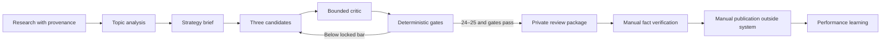

# LinkedIn Authority OS

**Turn research into a private, evidence-backed review package—not automatically published content.**

LinkedIn Authority OS is a local workflow for researching, drafting, critiquing, and learning from LinkedIn posts. Each candidate cycle creates exactly three voice-grounded drafts, maps claims to sources, applies bounded critique and deterministic honesty gates, and leaves publication entirely with the human owner.

## See the product before installing

Open the **[synthetic review package preview](examples/review-package-preview.md)**.

It shows the complete decision surface:

- strategy brief and evidence limitations;
- three candidate posts with claim IDs;
- critic scorecard;
- authority, citation, honesty, and public-safe-proof gates;
- recommendation or blocked explanation;
- explicit human-verification checklist.

The preview is intentionally synthetic and blocked from publication. That is a product behaviour, not a missing feature.

## Run the public workflow

Requires Python 3.11+ on macOS or Linux.

```bash
git clone https://github.com/Abhillashjadhav/Linkedin-research-posts.git
cd Linkedin-research-posts
make setup
make doctor
./bin/linkedin-os research --dry-run
./bin/linkedin-os draft --dry-run --package
make check
```

The dry run is offline and uses visibly synthetic fixtures. It does not invoke a Writer or Critic model, recommend a candidate for publication, or publish anything.

## Locked high-bar search

A live invocation no longer exposes the first completed draft batch. It runs up to four candidate cycles and returns prose only when at least one candidate satisfies all of these conditions:

- effective Critic score of **24–25**;
- hook score of at least **4/5**;
- every required authority, proof, honesty, citation, and relevance gate passes; and
- the opening does not repeat one rejected in an earlier cycle.

Each cycle still contains exactly three candidates and at most one light revision. When a cycle fails, its prose remains hidden. Only bounded angle, opening, score, and gate diagnostics are added to the next Writer prompt, with an explicit instruction to create a genuinely new narrative execution without changing the supplied strategy or inventing evidence.

After four unsuccessful live cycles, the command fails closed and returns no post. When `--package` is selected, rejected cycles may leave private `BLOCKED` audit packages; only a live `READY_FOR_HUMAN_REVIEW` package can clear the coordinator.

## What the workflow produces

A review package is created only through the explicit `--package` operation:

```text
manifest.json      provenance, privacy, and safety status
brief.md           audience, goal, angle, and evidence limitations
candidates.md      exactly three candidates with claim IDs
evaluation.json    critic scores, revision metadata, and gate results
sources.md         public-safe source metadata
final-package.md   recommendation or blocked reason plus review checklist
```

A recommendation means **ready for human review**. It never means approved, scheduled, or published.

## The product flow



### 1. Research

Store source material with provenance and public/private boundaries.

### 2. Analyse

Cluster themes and identify the strongest evidence-backed angle.

### 3. Route

Choose the strategic outcome separately from the content format.

### 4. Draft

Generate exactly three plain-text candidates per cycle from a bounded evidence brief.

### 5. Critique

Score five dimensions from 1–5 with at most one revision per cycle. The critic can rank; it cannot approve.

### 6. Gate and regenerate

Run deterministic authority, proof, honesty, citation, relevance, and safety checks. If no candidate clears the locked bar, hide the rejected prose and start a new candidate cycle with bounded diagnostics.

### 7. Package

Create a private bundle for human review, or explain precisely why no candidate is eligible.

### 8. Learn

Record manually published performance and compare like-for-like outcomes.

## Choose the strategic goal

| Goal | Intended outcome | Default evidence bar |
|---|---|---|
| **Reach** | Qualified non-follower exposure | Research evidence |
| **Authority** | Saves, sends, reposts, and useful discussion | Research evidence |
| **Opportunity** | Qualified inbound and demonstrated tool interest | Research plus validated public-safe proof |

Goal selection never silently chooses the format.

```bash
./bin/linkedin-os draft --dry-run --goal reach --format text
./bin/linkedin-os draft --dry-run --goal authority --format carousel
./bin/linkedin-os draft --dry-run --goal opportunity --format artifact-demo
```

## Live drafting boundary

Live or private drafting requires both an explicit private strategy file and explicit consent for model egress:

```bash
./bin/linkedin-os draft \
  --strategy-input data/private/strategy.json \
  --allow-model-egress
```

Opportunity drafting additionally requires a validated public-safe proof manifest under ignored `data/private/`. Artifact contents and private paths are not sent to the model.

## Safety model

- Publishing, scheduling, messaging, and authenticated browser automation are absent.
- Private data and review packages are git-ignored and owner-restricted.
- Synthetic research cannot become live evidence.
- Factual claims retain claim IDs and source traceability.
- Critic scores cannot approve content.
- Rejected candidate prose is not exposed by the high-bar coordinator.
- Deterministic gates fail closed on unsupported or malformed claims.
- Public-safe proof is required before opportunity-oriented artifact claims.
- Human approval and manual factual verification remain mandatory.

Detailed controls: [`docs/`](docs/).

## Record performance after manual publication

After a human independently verifies and publishes an eligible live candidate:

```bash
./bin/linkedin-os record-performance \
  --package-id <package-id> \
  --candidate candidate-1 \
  --manually-published-at 2026-07-16T09:00:00+05:30 \
  --checkpoint 24h \
  --channel organic \
  --observed-at 2026-07-17T09:15:00+05:30 \
  --impressions 1000 \
  --confirm-manual-publication

./bin/linkedin-os weekly-review
```

The system records observations; it does not infer that publication occurred.

## Use it when

- research-backed authority matters more than post volume;
- private context must remain local and explicitly consented;
- claims need source traceability;
- weak completed batches should be regenerated rather than presented;
- unsupported content should be blocked even when it sounds polished;
- performance learning must preserve goal and format context.

## Do not use it when

- you want an autonomous posting bot;
- you expect Critic scores or engagement predictions to replace editorial judgment;
- you have no source material for factual claims;
- you want synthetic fixtures converted into publishable evidence;
- you need Windows support for the private-data runtime today.

## Validation

```bash
make doctor
make check
```

`doctor` is read-only. `make check` runs the Git-aware privacy gate and warnings-as-errors test suite. Public Smoke runs the documented dry-run research, draft, package, and repository checks from a clean checkout.

## Current limitations

- macOS and Linux are supported; Windows is not currently supported for private-data operation.
- Live drafting depends on the locally configured Claude service and explicit consent.
- The bounded search stops after four live cycles rather than spending indefinitely.
- A 24–25 Critic score is a machine quality gate, not proof that a human will find the post compelling.
- Research ingestion, analytics collection, and publication are not automated.
- Structural citation checks reduce unsupported claims but cannot prove factual truth.
- Performance learning depends on manually recorded observations.

## Contributing

Keep publishing disabled, preserve the private-data boundary, add deterministic regression tests for safety changes, and state evidence limitations explicitly.

## License

See the repository license.
