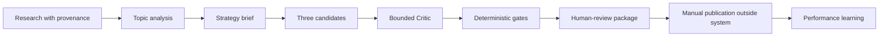

# LinkedIn Authority OS

**A local, evidence-backed workflow for researching, drafting, reviewing, and learning from LinkedIn posts without automatic publishing.**

The system turns research into three voice-grounded candidates, scores them with a bounded Critic, applies deterministic honesty and citation gates, and produces a private package for human review. Publishing remains disabled.

## Try the synthetic workflow

Requires Python 3.11+ on macOS or Linux.

```bash
git clone https://github.com/Abhillashjadhav/Linkedin-research-posts.git
cd Linkedin-research-posts
make setup
make doctor
./bin/linkedin-os research --dry-run
./bin/linkedin-os draft --dry-run
./bin/linkedin-os draft --dry-run --package
make check
```

The dry run is offline and uses visibly synthetic fixtures. It does not invoke a Writer or Critic model, recommend a candidate for publication, or publish anything.

## What the workflow produces

For a live, consented run:

1. **Research:** store source material with provenance.
2. **Analyse:** cluster topics and identify the strongest evidence-backed angle.
3. **Route:** choose a strategic outcome—Reach, Authority, or Opportunity—separately from format.
4. **Draft:** generate exactly three plain-text candidates from a bounded evidence brief.
5. **Critique:** score five dimensions from 1–5 with at most one revision.
6. **Gate:** run deterministic authority, proof, honesty, citation, and relevance checks.
7. **Package:** write a private, review-only bundle for human verification.
8. **Learn:** record manually published performance and compare like-for-like outcomes.



## Strategic goals

| Goal | Intended outcome | Default evidence bar |
|---|---|---|
| Reach | Qualified non-follower exposure | Research evidence |
| Authority | Saves, sends, reposts, and useful discussion | Research evidence |
| Opportunity | Qualified inbound and tool interest | Research plus validated public-safe proof |

Goal selection never silently chooses the content format.

```bash
./bin/linkedin-os draft --dry-run --goal reach --format text
./bin/linkedin-os draft --dry-run --goal authority --format carousel
./bin/linkedin-os draft --dry-run --goal opportunity --format artifact-demo
```

## Human-review package

An explicit `--package` operation creates an ignored local directory containing:

- `manifest.json` — provenance and safety status;
- `brief.md` — strategy and evidence limitations;
- `candidates.md` — all three candidates and claim IDs;
- `evaluation.json` — scores, revision metadata, and gate results;
- `sources.md` — public-safe source metadata;
- `final-package.md` — recommendation or blocked explanation plus checklist.

A recommendation means **ready for human review**, not approved or published. Manual fact verification remains required.

## Live drafting boundary

Live/private drafting requires both an explicit private strategy file and explicit consent for model egress:

```bash
./bin/linkedin-os draft \
  --strategy-input data/private/strategy.json \
  --allow-model-egress
```

Opportunity drafting additionally requires a validated public-safe proof manifest under ignored `data/private/`. Artifact contents and private paths are not sent to the model.

## Safety model

- Publishing, scheduling, messaging, and authenticated browser automation are absent.
- Private data and output packages are git-ignored and owner-restricted.
- Synthetic research cannot become live evidence.
- Factual claims retain claim IDs and source traceability.
- Critic scores cannot approve content.
- Deterministic gates fail closed on unsupported or malformed claims.
- Human approval and manual fact verification are always required.

Detailed controls: [`docs/`](docs/).

## Record performance after manual publication

After a human independently verifies and publishes an eligible live candidate:

```bash
./bin/linkedin-os record-performance \
  --package-id <package-id> \
  --candidate candidate-1 \
  --manually-published-at 2026-07-16T09:00:00+05:30 \
  --checkpoint 24h \
  --channel organic \
  --observed-at 2026-07-17T09:15:00+05:30 \
  --impressions 1000 \
  --confirm-manual-publication

./bin/linkedin-os weekly-review
```

The system records observations; it does not infer that publication occurred.

## Validation

```bash
make doctor
make check
```

`doctor` is read-only. `make check` runs the Git-aware privacy gate and the warnings-as-errors test suite.

## Current limitations

- macOS and Linux are supported; Windows is not currently supported for the private-data runtime.
- Live drafting depends on the locally configured Claude service and explicit consent.
- Research ingestion, analytics, and publication are not automated.
- Structural citation checks reduce unsupported claims but cannot prove factual truth.
- Performance learning depends on manually recorded observations.

## Contributing

Keep publishing disabled, preserve the private-data boundary, add deterministic regression tests for safety changes, and state evidence limitations explicitly.

## License

See the repository license.
