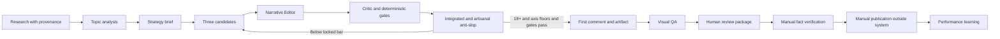

# LinkedIn Authority OS

**Turn research into a private, evidence-backed review package—not automatically published content.**

LinkedIn Authority OS is a local workflow for researching, drafting, critiquing, and learning from LinkedIn posts. Each candidate cycle creates exactly three voice-grounded drafts, maps claims to sources, applies bounded critique and deterministic honesty gates, and leaves publication entirely with the human owner.

For trace-first campaign runs, the executable order is:

```text
Scout → Thesis → Writer (3) → Narrative Editor → Critic → deterministic gates
→ integrated Anti-AI-Slop → bounded regeneration → external no-ai-slop edit
→ post-edit Re-Critic/gates → First Comment Writer/Reviewer → Artifact Editor
→ rendered artifact → Visual QA → human-review package
```

Every LLM stage records its runtime, exact model, and reasoning effort. The
preferred campaign hierarchy is GPT-5.6 Sol/high for Writer, GPT-5.6 Sol/max
for Narrative Editor and the external artisanal edit, and GPT-5.6 Sol/ultra
for Critic and review stages. The Critic is never weaker than the Writer.

## See the product before installing

Open the **[synthetic review package preview](examples/review-package-preview.md)**.

It shows the complete decision surface:

- strategy brief and evidence limitations;
- three candidate posts with claim IDs;
- critic scorecard;
- authority, citation, honesty, and public-safe-proof gates;
- recommendation or blocked explanation;
- explicit human-verification checklist.

The preview is intentionally synthetic and blocked from publication. That is a product behaviour, not a missing feature.

## Run the public workflow

Requires Python 3.11+ on macOS or Linux.

```bash
git clone https://github.com/Abhillashjadhav/Linkedin-research-posts.git
cd Linkedin-research-posts
make setup
make doctor
./bin/linkedin-os research --dry-run
./bin/linkedin-os draft --dry-run --package
make check
```

The dry run is offline and uses visibly synthetic fixtures. It does not invoke a Writer or Critic model, recommend a candidate for publication, or publish anything.

## Run V1 discovery through a review-ready post

```bash
./bin/linkedin-os discover \
  --profile data/private/authority-profile.json \
  --days 7 \
  --allow-web-research \
  --allow-model-egress \
  --generate-post
```

V1 retries unavailable Scout surfaces once, preserves every topic with a
combined momentum and authority-fit score of at least 40/50 in a rolling
seven-day private inventory, and selects the highest qualifying thesis before
continuing through the existing high-bar drafting workflow. A clearly labelled
authority-fit fallback may nominate a well-evidenced topic when current
conversation momentum is insufficient; it never relabels that topic as
trending. Publication remains disabled.

If a run stops at Evidence verification, resume from its preserved run folder
without repeating conversation discovery or topic admission:

```bash
./bin/linkedin-os discover \
  --profile data/private/authority-profile.json \
  --days 7 \
  --resume-from data/private/daily-discovery/<date>/<failed-run> \
  --output-dir data/private/daily-discovery/<date>/<resume-run> \
  --allow-web-research \
  --allow-model-egress \
  --generate-post
```

The resume keeps the original `as-of` timestamp, admitted topics, and
representative URLs. It reuses exact body-verified private evidence first and
performs one targeted verification call only when evidence is still missing.
Runs created before `admitted-topics.json` was introduced can resume from the
rolling inventory only while that inventory still carries the failed run's
exact timestamp; otherwise the command fails closed rather than guessing.

## Locked high-bar search

A live invocation runs at most four scored iterations. Writing acceptance has one rule:

- effective Critic score of at least **18/25**;
- hook and voice scores of at least **4/5**; middle escalation, earned closer,
  and specificity/source quality remain scored and may trade off inside the total.

Authority, proof, honesty, citation, relevance, resonance, hook-register and anti-slop checks are editorial advisories. Their raw findings remain visible; they cannot veto score acceptance or discard an improving edit. Passing text is returned immediately, except that frozen repair may attempt one automatic rewrite for unsupported factual wording. On exhaustion, the best draft is delivered with unmet score targets recorded honestly. Successful artifact delivery returns exit code 0 even when writing scores remain below target; missing inputs, malformed model output, authorization and secure-file errors still fail.

`eval-package --repair` scores the saved candidate, then edits that same candidate at most three times. It reuses the saved evidence and never restarts discovery. The dashboard links `evaluated-<candidate-id>.md` and separates score shortfalls from advisory findings. Publication remains manual.

The Resonance model does not return a `PASS`/`BLOCKED` label. It returns the
five scores and locked-thesis flag; Python is the only status owner and derives
the decision from those fields. A block records every failed axis, its
shortfall, any total-score shortfall, and a failed thesis-fit flag. There is no
second model verdict that can contradict the deterministic result.

When Resonance reports that the selected evidence supports a narrower claim
than the original thesis, rerun only drafting with `--narrow-to-evidence`.
This keeps the selected topic and evidence identities unchanged, asks for an
evidence-bounded thesis and product decision, and then applies the same
Resonance, Critic, proof, honesty, citation, privacy, and relevance gates. It
does not rerun discovery, acquire evidence, or lower the 4/5 proof-value floor.

After four unsuccessful live cycles, the command delivers the best draft with `COMPLETED_WITH_WARNINGS`. Unmet writing targets and editorial findings stay visible. Existing `BLOCKED` audit packages are historical diagnostics, not a reason to discard the delivered draft.

## Run a persisted five-day campaign

Campaign mode uses the same `draft` command, but takes one public, source-grounded
five-day spec and the separate `Abhillashjadhav/no-ai-slop` editor files:

```bash
git clone --depth 1 https://github.com/Abhillashjadhav/no-ai-slop.git /tmp/no-ai-slop

./bin/linkedin-os draft \
  --run-spec campaigns/2026-08-10-to-14/spec.json \
  --trace-output campaigns/2026-08-10-to-14/run \
  --no-ai-slop-skill /tmp/no-ai-slop/SKILL.md \
  --no-ai-slop-eval /tmp/no-ai-slop/eval.md
```

The coordinator runs each in-scope day independently. Every executed day ends
in either `READY_FOR_HUMAN_REVIEW` or an explicit `BLOCKED` trace; a preserved
published day may instead carry an aggregate-only out-of-scope status. The
coordinator uses the same 18/25 total and named per-axis floors as standalone drafting. The separate first-comment rubric also uses an 18/25 total floor while retaining its evidence, anti-slop, and artisanal checks. Rejected prose is omitted from the persisted public trace.
Visual plans are rendered as repository-native SVG files and must pass both
layout checks and the separate Visual QA stage.

After a complete five-day run, `--campaign-day Tuesday` (or another weekday)
reruns only that day and rebuilds the aggregate from all five persisted traces.
The rerun clears only that day's replaceable post, comment, and SVG outputs, so
stale artifacts cannot survive a changed result.

## What the workflow produces

A review package is created only through the explicit `--package` operation:

```text
manifest.json      provenance, privacy, and safety status
brief.md           audience, goal, angle, and evidence limitations
candidates.md      exactly three candidates with claim IDs
evaluation.json    critic scores, revision metadata, and gate results
sources.md         public-safe source metadata
final-package.md   recommendation or blocked reason plus review checklist
```

A recommendation means **ready for human review**. It never means approved, scheduled, or published.

## The product flow


```mermaid
flowchart LR
    A[Research with provenance] --> B[Topic analysis]
    B --> C[Strategy brief]
    C --> D[Three candidates]
    D --> E[Narrative Editor]
    E --> F[Critic and deterministic gates]
    F --> G[Integrated and artisanal anti-slop]
    G -->|Below locked bar| D
    G -->|18+ and axis floors and gates pass| H[First comment and artifact]
    H --> I[Visual QA]
    I --> J[Human review package]
    J --> K[Manual fact verification]
    K --> L[Manual publication outside system]
    L --> M[Performance learning]
```

### 1. Research

Store source material with provenance and public/private boundaries.

### 2. Analyse

Cluster themes and identify the strongest evidence-backed angle.

### 3. Route

Choose the strategic outcome separately from the content format.

### 4. Draft

Generate exactly three plain-text candidates per cycle from a bounded evidence brief.

### 5. Critique

Score five dimensions from 1–5 with at most one revision per cycle. The critic can rank; it cannot approve.

### 6. Gate and regenerate

Run deterministic authority, proof, honesty, citation, relevance, and safety checks. If no candidate clears the locked bar, hide the rejected prose and start a new candidate cycle with bounded diagnostics.

### 7. Package

Create a private bundle for human review, or explain precisely why no candidate is eligible.

### 8. Learn

Record manually published performance and compare like-for-like outcomes.

## Choose the strategic goal

| Goal | Intended outcome | Default evidence bar |
|---|---|---|
| **Reach** | Qualified non-follower exposure | Research evidence |
| **Authority** | Saves, sends, reposts, and useful discussion | Research evidence |
| **Opportunity** | Qualified inbound and demonstrated tool interest | Research plus validated public-safe proof |

Goal selection never silently chooses the format.

```bash
./bin/linkedin-os draft --dry-run --goal reach --format text
./bin/linkedin-os draft --dry-run --goal authority --format carousel
./bin/linkedin-os draft --dry-run --goal opportunity --format artifact-demo
```

## Live drafting boundary

Live or private drafting requires both an explicit private strategy file and explicit consent for model egress:

```bash
./bin/linkedin-os draft \
  --strategy-input data/private/strategy.json \
  --allow-model-egress
```

Opportunity drafting additionally requires a validated public-safe proof manifest under ignored `data/private/`. Artifact contents and private paths are not sent to the model.

## Re-evaluate and progressively repair a frozen candidate

Use the existing package, strategy, and evidence when research is already complete. The
first iteration scores the frozen candidate unchanged. A passing candidate is returned
immediately unless unsupported factual wording needs one automatic rewrite attempt.
At most three bounded edits follow, for four scored iterations total:

```bash
./bin/linkedin-os eval-package \
  --package outputs/YYYY-MM-DD/topic-slug \
  --candidate candidate-2 \
  --strategy-input data/private/strategy.json \
  --evidence-manifest data/private/evidence.json \
  --db data/private/authority_os.sqlite \
  --allow-model-egress \
  --repair
```

Every retained edit keeps the same candidate ID, angle, and claim IDs. Only the overall
total must not decrease; individual axes may trade off. An edit must improve a score or
reduce a finding. Hook and voice remain final acceptance targets. Editorial findings
stay advisory, including after the automatic factual rewrite. A rejected edit never
replaces the retained best candidate. If targets remain unmet after repair, the draft is
delivered with `COMPLETED_WITH_WARNINGS`, not a false score pass or a workflow failure.
Discovery, research, thesis selection, and the original Writer are not rerun.

## Safety model

- Publishing, scheduling, messaging, and authenticated browser automation are absent.
- Private data and review packages are git-ignored and owner-restricted.
- Synthetic research cannot become live evidence.
- Factual claims retain claim IDs and source traceability.
- Critic scores cannot approve content.
- Rejected candidate prose is not exposed by the high-bar coordinator.
- Deterministic gates fail closed on unsupported or malformed claims.
- Public-safe proof is required before opportunity-oriented artifact claims.
- Human approval and manual factual verification remain mandatory.

Detailed controls: [`docs/`](docs/).

## Record performance after manual publication

After a human independently verifies and publishes an eligible live candidate:

```bash
./bin/linkedin-os record-performance \
  --package-id <package-id> \
  --candidate candidate-1 \
  --manually-published-at 2026-07-16T09:00:00+05:30 \
  --checkpoint 24h \
  --channel organic \
  --observed-at 2026-07-17T09:15:00+05:30 \
  --impressions 1000 \
  --confirm-manual-publication

./bin/linkedin-os weekly-review
```

The system records observations; it does not infer that publication occurred.

## Use it when

- research-backed authority matters more than post volume;
- private context must remain local and explicitly consented;
- claims need source traceability;
- weak completed batches should be regenerated rather than presented;
- unsupported content should be blocked even when it sounds polished;
- performance learning must preserve goal and format context.

## Do not use it when

- you want an autonomous posting bot;
- you expect Critic scores or engagement predictions to replace editorial judgment;
- you have no source material for factual claims;
- you want synthetic fixtures converted into publishable evidence;
- you need Windows support for the private-data runtime today.

## Validation

```bash
make doctor
make check
```

`doctor` is read-only. `make check` runs the Git-aware privacy gate and warnings-as-errors test suite. Public Smoke runs the documented dry-run research, draft, package, and repository checks from a clean checkout.

## Current limitations

- macOS and Linux are supported; Windows is not currently supported for private-data operation.
- Legacy single-post live drafting depends on the locally configured Claude service and explicit consent; trace-first campaign mode uses the authenticated Codex CLI with explicit per-stage model settings.
- The bounded search stops after four live cycles rather than spending indefinitely.
- Passing the 18/25 total, the hook and voice floors, and every hard gate creates review eligibility; it is not proof that a human will find the post compelling.
- Research ingestion, analytics collection, and publication are not automated.
- Structural citation checks reduce unsupported claims but cannot prove factual truth.
- Performance learning depends on manually recorded observations.

## Contributing

Keep publishing disabled, preserve the private-data boundary, add deterministic regression tests for safety changes, and state evidence limitations explicitly.

## License

See the repository license.
