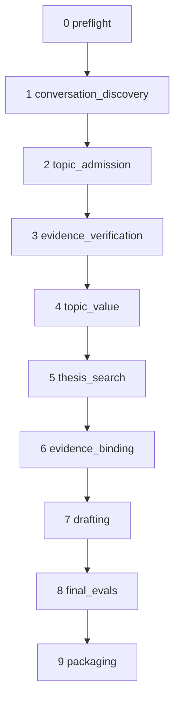

# Packet 07 — local CEO/orchestrator and runtime plan

## Decision

The rebuild has one local composition root and one orchestration authority. It runs
the ten typed stages below, owns the only end-to-end clock, records the only
canonical first blocker, and is the only component allowed to advance the run.

This packet is the integration contract for Packets 01–06. It does not modify the
current repair runtime, does not weaken any product gate, and does not push or
publish anything.

The rebuilt path is considered ready for GitHub replication only after the complete
installed local artifact passes the deterministic test suite and three consecutive
live runs. Three is the owner-approved release count and is part of the immutable
release plan; a system failure or release-candidate change resets the streak.

## Locked product outcome

- Target end-to-end duration: `420` seconds.
- Hard end-to-end deadline: `480` seconds, including cancellation and final durable
  state.
- Body-verified evidence may be reused after bounded live attempts only while its
  source publication date is still inside the same requested seven-day window and
  its stable identity and topic link remain valid.
- A confirmed published atomic value is never selected again. Evidence reuse and
  atomic-value reuse are separate decisions.
- A legitimate content/gate rejection is an evaluated product outcome. Timeout,
  unavailable dependency, contract drift, identity drift, or missing observation is
  a system failure.
- The runtime produces at most a private `READY_FOR_HUMAN_REVIEW` package. It never
  approves, schedules, or publishes.

## Reconciliation of Packets 01–06

This packet resolves the few places where the component packets intentionally left
an orchestrator decision open.

| Packet | Contract adopted here | Reconciliation |
| --- | --- | --- |
| 01 Scout timeout | Bounded live evidence attempts, then exact same-window cache; persist verified evidence before Topic Value. | The provisional 120-second evidence budget is replaced by the canonical 85-second stage allocation below. Attempt caps are 45 seconds primary and 20 seconds retry, preserving 20 seconds for cache validation and atomic persistence. |
| 02 discovery | Stable candidate IDs, local deterministic scoring, public-only surface Scouts, at least four successful surfaces and at least ten usable signals. | Conversation discovery and evidence verification are separate top-level stages. The earlier aggregate 180-second discovery proposal is superseded by 100 + 5 + 85 seconds for conversation discovery, topic admission, and evidence verification. |
| 03 evidence identity | Stable `evidence_id`, verification receipt, topic link, exact evidence-set manifest, multi-cluster support. | `evidence_payload_sha256` is canonical; legacy `content_hash` is a migration alias only. Generated prose and run-local `signal-*` labels are never lookup keys. |
| 04 Topic Value/thesis | Candidate-local filtering, stable evidence refs, thesis bound to one passed Topic Value candidate, fixed thresholds and retry semantics. | Topic Value and thesis are sequential stages. Transport retries and semantic regeneration have separate counters and both spend the same stage budget. |
| 05 draft/acceptance | Writer → editor → exact-artifact register check → v2 Critic → hard gates → one acceptance decision → secure package. | `BEST_EFFORT` is an artifact class, not a run outcome. Safe retention, when eligible, is committed as part of `final_evals` before that stage records its terminal failure; it does not start the later review-package stage. A quality rejection exits as `REJECTED_BY_PRODUCT_GATE` (`2`); a safe draft retained after a system failure does not change the `SYSTEM_FAILED` (`3`) outcome. The canonical exit codes are those below. |
| 06 runtime/observability | One composition root, typed state machine, journal authority, explicit budgets, typed failures, exact first blocker. | This packet freezes the APIs, task graph, idempotency rules, cancellation fences, and public commands needed by all other packets. |

No values from Packet 04 or Packet 05 are recalibrated here. In particular, atomic
novelty remains `< 0.72`, claim/body support remains a shadow diagnostic at `0.18`,
Topic Value and thesis floors remain fixed, the v2 voice rubric remains live, and
honesty, citation, proof, privacy, relevance, voice, and the named acceptance floors
remain binding.

## One explicit composition root

`bin/linkedin-os` performs environment selection only, then invokes
`authority_os.rebuild.app:main`. `build_runtime()` is the only place that selects
adapters or constructs stages.

```python
def build_runtime(settings: Settings, ports: ExternalPorts) -> Orchestrator:
    plan = build_plan(settings, ports)
    journal = OwnerOnlyJournal(settings.run_root)
    checkpoints = CheckpointStore(settings.run_root)
    return Orchestrator(
        plan=plan,
        journal=journal,
        checkpoints=checkpoints,
        clock=SystemClock(),
        cancellation=SignalCancellation(),
    )
```

Rules:

1. Importing a module has no runtime side effects.
2. No `install()`, monkeypatch, module-global replacement, or import-order behavior
   exists in the rebuilt path.
3. Live, dry-run, and test modes inject different external adapters into the same
   stage graph. They do not select different workflow implementations.
4. All stage calls are typed and preferably in-process. If process isolation is
   required, request and response are versioned JSON envelopes; stdout/stderr is
   never an API.
5. The immutable plan, stage registry, schemas, configs, models, prompts, v2 rubric,
   voice profile, and acceptance policy are hashed before `preflight` starts.

## Canonical ten-stage graph



The top-level dependency graph is deliberately linear. Parallelism exists only
inside a stage whose complete input is already frozen; no speculative downstream
stage may run on data that has not passed its producer's contract.

| Order | Stage | Required input | Contract output |
| ---: | --- | --- | --- |
| 0 | `preflight` | operator request and built plan | validated permissions, safe paths, frozen `as_of`/window, profile, publication-history snapshot, model availability |
| 1 | `conversation_discovery` | public scope and deadline; no private profile sent to web ports | deterministic ranked conversations with stable surface provenance and local scores |
| 2 | `topic_admission` | ranked conversations, rolling inventory, published-history snapshot | admitted unused stable topic IDs and explicit `current`, `inventory`, or `authority` route |
| 3 | `evidence_verification` | admitted topic IDs and frozen seven-day window | 3–7 stable body-verified evidence records, receipts, exact topic links, and live/cache route |
| 4 | `topic_value` | verified evidence and published atomic-value snapshot | all candidate decisions plus every eligible Topic Value candidate |
| 5 | `thesis_search` | eligible Topic Value candidates, proof/profile snapshot | all thesis scorecards plus selected thesis bound to one Topic Value ID and exact evidence IDs |
| 6 | `evidence_binding` | selected thesis and evidence store | immutable exact evidence-set manifest; no topic-text lookup |
| 7 | `drafting` | selected thesis, strategy, and immutable manifest | exactly three grounded candidate artifacts and Writer/editor traces |
| 8 | `final_evals` | exact immutable candidate artifacts | v2 Critic scorecards, deterministic gates/checks, acceptance decisions, optional bounded-repair result |
| 9 | `packaging` | accepted decision and its exact evaluated candidate | owner-only `READY_FOR_HUMAN_REVIEW` package, artifact manifest, and typed terminal outcome |

Earlier stages may be `applicability=NOT_APPLICABLE` only for an explicit standalone
draft request carrying a previously validated evidence manifest. Applicability is a
separate field; no skipped stage is represented as `PASS`.

## Internal concurrency plan

| Stage | Concurrent work | Join/fence rule |
| --- | --- | --- |
| `conversation_discovery` | Seven public surface lanes launch concurrently. Failed transient lanes may retry concurrently inside the same stage budget. | Rank only after every accepted worker result is frozen or cancelled. Require both four successful surfaces and ten usable signals; late futures cannot write. Consolidation and authority observation then run against the frozen set. |
| `evidence_verification` | Evidence workers fan out by admitted topic or missing evidence need. Retry only transiently failed workers. | Validate, deduplicate, and atomically persist exact evidence/receipts/links after the join. Cache can fill only missing work after live attempts; it cannot broaden scope. |
| `topic_value` | Deterministic gate evaluation may process returned candidates concurrently. | Record all candidates, sort by stable ID, then filter candidate-locally. A failed sibling cannot veto a passing candidate. |
| `thesis_search` | Candidate scoring within a generated batch may be evaluated concurrently where adapters permit. | A semantic cycle joins fully before deterministic ranking. Cycles remain sequential because the next prompt depends on prior feedback. |
| `drafting` | Local validation of three returned candidates may run concurrently. External batch calls remain one adapter request unless a measured adapter contract justifies fan-out. | Freeze immutable candidate bytes before any evaluation. |
| `final_evals` | Deterministic hard gates and register/anti-slop checks may run concurrently per immutable candidate; one batched Critic call may score the candidate set. | Acceptance runs only after the exact artifact has all required results. No check can mutate candidate bytes. |

Concurrency is bounded by configured worker pools and the shared `Budget`; a stage
cannot create an independent deadline per worker. Worker completion is committed
through a generation token. Once a stage terminal event is durable, results bearing
its old token are discarded.

## Frozen runtime APIs

### Types and statuses

```python
class StageId(StrEnum):
    PREFLIGHT = "preflight"
    CONVERSATION_DISCOVERY = "conversation_discovery"
    TOPIC_ADMISSION = "topic_admission"
    EVIDENCE_VERIFICATION = "evidence_verification"
    TOPIC_VALUE = "topic_value"
    THESIS_SEARCH = "thesis_search"
    EVIDENCE_BINDING = "evidence_binding"
    DRAFTING = "drafting"
    FINAL_EVALS = "final_evals"
    PACKAGING = "packaging"

class StageStatus(StrEnum):
    NOT_EVALUATED = "NOT_EVALUATED"
    RUNNING = "RUNNING"
    PASS = "PASS"
    FAIL = "FAIL"

class Applicability(StrEnum):
    APPLICABLE = "APPLICABLE"
    NOT_APPLICABLE = "NOT_APPLICABLE"

class CandidateDecision(StrEnum):
    PASS = "PASS"
    REJECTED = "REJECTED"
    UNAVAILABLE = "UNAVAILABLE"
    NOT_EVALUATED = "NOT_EVALUATED"

class RunOutcome(StrEnum):
    RUNNING = "RUNNING"
    READY_FOR_HUMAN_REVIEW = "READY_FOR_HUMAN_REVIEW"
    REJECTED_BY_PRODUCT_GATE = "REJECTED_BY_PRODUCT_GATE"
    SYSTEM_FAILED = "SYSTEM_FAILED"
    CANCELLED = "CANCELLED"

class FailureKind(StrEnum):
    PRODUCT_REJECTION = "PRODUCT_REJECTION"
    DEPENDENCY_TIMEOUT = "DEPENDENCY_TIMEOUT"
    DEPENDENCY_UNAVAILABLE = "DEPENDENCY_UNAVAILABLE"
    INVALID_INPUT = "INVALID_INPUT"
    CONTRACT_VIOLATION = "CONTRACT_VIOLATION"
    IDENTITY_VIOLATION = "IDENTITY_VIOLATION"
    INTEGRITY_REJECTION = "INTEGRITY_REJECTION"
    BUDGET_EXHAUSTED = "BUDGET_EXHAUSTED"
    OBSERVABILITY_FAILURE = "OBSERVABILITY_FAILURE"
    CANCELLED = "CANCELLED"
```

`BLOCKED` and `BEST_EFFORT` are not stage or run statuses. They may remain display
or artifact labels during migration only.

### Plan, context, budget, and stage port

```python
@dataclass(frozen=True)
class RuntimePlan:
    schema_version: int
    plan_version: str
    stages: tuple["StageSpec", ...]
    target_seconds: int                 # 420
    hard_deadline_seconds: int          # 480
    teardown_reserve_seconds: int       # 10
    model_assignments: Mapping[str, "ModelConfig"]
    contract_digests: Mapping[str, str]
    plan_sha256: str

@dataclass(frozen=True)
class StageSpec(Generic[InputT, OutputT]):
    id: StageId
    order: int
    input_schema: str
    output_schema: str
    target_seconds: int
    hard_ceiling_seconds: int
    retry_policy: "RetryPolicy"
    execute: "StagePort[InputT, OutputT]"

@dataclass(frozen=True)
class RunContext:
    run_id: str
    request_sha256: str
    plan_sha256: str
    as_of: datetime
    window_start: datetime
    window_end: datetime
    run_started_monotonic_ns: int
    target_deadline_monotonic_ns: int
    hard_deadline_monotonic_ns: int
    operational_deadline_monotonic_ns: int
    cancellation: "CancellationToken"

class StagePort(Protocol[InputT, OutputT]):
    def execute(
        self,
        request: InputT,
        *,
        context: RunContext,
        budget: "Budget",
        recorder: "StageRecorder",
    ) -> "StageResult[OutputT]": ...

@dataclass(frozen=True)
class StageResult(Generic[OutputT]):
    stage: StageId
    status: Literal[StageStatus.PASS, StageStatus.FAIL]
    output: OutputT | None
    failure: "StageFailure | None"
    input_sha256: str
    output_sha256: str | None
    artifact_refs: tuple["ArtifactRef", ...]
    attempt_count: int
    elapsed_ms: int
```

A passing result requires a schema-valid stored output and digest. A failing result
requires exactly one typed failure and no contract output. A stage exception is
converted at its boundary to a safely redacted `CONTRACT_VIOLATION`; adapters never
return ambiguous `None`/exit-code combinations.

### Failure and first blocker

```python
@dataclass(frozen=True)
class StageFailure:
    failure_id: str
    stage: StageId
    kind: FailureKind
    code: str
    safe_message: str
    expected: str
    observed: str
    retryable: bool
    attempt_count: int
    elapsed_ms: int
    details: Mapping[str, JsonValue]
    artifact_refs: tuple[ArtifactRef, ...]
```

The first durable stage failure wins a compare-and-set into `first_blocker`. Cleanup,
projection, or cancellation after that point cannot replace it. A projection failure
may prevent release verification from counting the run, but the original blocker
remains the operator-facing first failure.

### Budget API

```python
class Budget:
    def target_remaining(self) -> timedelta: ...
    def run_remaining(self) -> timedelta: ...
    def stage_remaining(self) -> timedelta: ...
    def downstream_reserve(self) -> timedelta: ...
    def timeout_for(self, attempt_cap: timedelta) -> timedelta:
        # min(attempt_cap, stage_remaining,
        #     run_remaining - downstream_reserve - teardown_reserve)
        ...
    def require(self, minimum: timedelta, reason_code: str) -> None: ...
    def child(self, attempt_cap: timedelta) -> "AttemptBudget": ...
```

Only the orchestrator creates a stage budget. An adapter receives an absolute
monotonic deadline plus the derived timeout; it cannot increase either. Retries spend
the original stage allocation and start only when `require()` proves that the retry
plus the stage's own persistence reserve can finish without consuming mandatory
downstream or teardown reserves.

### Journal/checkpoint APIs

```python
class RunJournal(Protocol):
    def append_and_fsync(self, event: RunEvent) -> None: ...
    def compare_and_set_first_blocker(self, failure: StageFailure) -> bool: ...
    def replay(self) -> RunState: ...

class CheckpointStore(Protocol):
    def load(
        self, stage: StageId, *, plan_sha256: str, input_sha256: str
    ) -> StageCheckpoint | None: ...
    def commit(self, checkpoint: StageCheckpoint) -> ArtifactRef: ...
    def verify(self, checkpoint: StageCheckpoint) -> None: ...
```

The journal is authoritative. Snapshots, dashboards, and HTML are deterministic
projections and are never consumed as runtime decisions.

## State machine

Legal transitions for an applicable stage are exactly:

```text
NOT_EVALUATED -> RUNNING -> PASS
NOT_EVALUATED -> RUNNING -> FAIL
```

An inapplicable stage remains `NOT_EVALUATED` with
`applicability=NOT_APPLICABLE`. It is never advanced.

Run rules:

1. The run begins with all ten stages durably registered in canonical order.
2. Only the next applicable `NOT_EVALUATED` stage may enter `RUNNING`.
3. `stage_started` is fsynced before an adapter is invoked.
4. A stage emits progress/candidate/attempt events but terminates once.
5. The output checkpoint is validated, fsynced, and hashed before `stage_passed`.
6. `stage_failed` atomically fixes the first blocker. No later stage starts.
7. Later applicable stages stay `NOT_EVALUATED` and reference
   `UPSTREAM_BLOCKER`, the blocking stage, and the immutable failure ID.
8. `READY_FOR_HUMAN_REVIEW` is possible only when every applicable stage passes and
   packaging commits its manifest last.
9. Outcome derives from failure kind, not provider text or process exit code.

When final evaluation exhausts quality repair, it may attach a private safe-retention
artifact to its own `FAIL` result only if the candidate passed every required hard
gate. Packaging remains `NOT_EVALUATED`, because a best-effort draft is not a review
package. Dashboard projection is supervisor finalization and still runs from the
journal after any terminal outcome.

## Deadline and reserves

There are three run boundaries:

- `target_deadline = start + 420s`: service objective and consecutive-run metric.
- `operational_deadline = start + 470s`: no new product work starts after this
  point; ten seconds remain for termination and canonical finalization.
- `hard_deadline = start + 480s`: the supervisor must have stopped children and
  durably finalized or written the emergency record.

The following allocation is canonical for the first integrated local build. Values
may be tuned only from recorded local measurements; the 420/480 product boundaries
and product gates cannot change.

| Stage | Target | Hard ceiling | Hard cumulative finish | Protected work inside ceiling |
| --- | ---: | ---: | ---: | --- |
| `preflight` | 5s | 10s | 10s | at least 2s plan/journal commit |
| `conversation_discovery` | 85s | 100s | 110s | at least 10s local consolidation/scoring/persistence |
| `topic_admission` | 5s | 5s | 115s | local validation and inventory transition |
| `evidence_verification` | 70s | 85s | 200s | 45s primary, 20s transient retry, 20s cache validation/persistence |
| `topic_value` | 35s | 40s | 240s | record all candidate decisions before filtering |
| `thesis_search` | 55s | 65s | 305s | transport retry/semantic cycle only when a full join and checkpoint fit |
| `evidence_binding` | 5s | 5s | 310s | exact manifest validation and commit |
| `drafting` | 90s | 100s | 410s | candidate generation, editor, immutable candidate checkpoint |
| `final_evals` | 50s | 50s | 460s | register check, v2 Critic, hard gates, acceptance, bounded repair only if it fits |
| `packaging` | 10s | 10s | 470s | owner-only artifact set, manifest last, dashboard projection |
| Supervisor finalization | 10s | 10s | 480s | cancel/kill, journal final event, snapshot/emergency record |

Stage targets sum to 410 seconds; the normal ten-second supervisor finalization
brings the end-to-end target to 420 seconds. Hard stage ceilings sum to 470 seconds;
the teardown reserve completes the 480-second hard boundary.

At each stage start, `downstream_reserve` is the sum of all remaining hard ceilings.
An attempt receives:

```text
min(attempt cap,
    current stage remaining,
    operational deadline - now - downstream hard reserve)
```

No stage may borrow from downstream hard reserve. Unused target time permits the
current or a later stage to operate up to its own hard ceiling, never beyond it.
Semantic repair is skipped unless a complete Writer/evaluation/checkpoint cycle fits.

## Evidence timeout course correction

The current screenshot is represented by a typed stage failure, not a generic model
exception. The rebuilt evidence stage follows this order:

```python
cached = store.load_candidate_linked_receipts(admitted_topic_ids, frozen_window)

primary = run_live_workers(cap_seconds=45)
if primary.transient_missing and budget.can_fit(seconds=20 + 20):
    retry = retry_only_transient_missing(cap_seconds=20)

validated_live = validate_and_commit_live(primary, retry)
if len(validated_live) < 3 and attempts_exhausted_transiently:
    recovered = validate_exact_same_window_cache(cached)

selected = deterministic_union(validated_live, recovered, maximum=7)
if len(selected) < 3:
    fail("INSUFFICIENT_VERIFIED_EVIDENCE")
commit_receipts_and_topic_links_before_topic_value(selected)
```

Cache does not rescue invalid schema, unsafe URL, blank/unread body, identity drift,
or unbound topic scope. Social surface summaries are never promoted to factual
evidence. Cache route, ages, rejection counts, attempt durations, and exact stable
identities are recorded without source bodies.

## Cancellation and late-result fencing

1. SIGINT, SIGTERM, or explicit cancellation atomically sets the shared token.
2. The orchestrator stops submitting work and asks active adapters to cancel.
3. Pending futures are cancelled. Active subprocesses run in their own process group:
   send TERM, wait at most two seconds inside the teardown reserve, then KILL.
4. If no earlier blocker exists, the active stage terminates with
   `FailureKind.CANCELLED` and the run outcome is `CANCELLED`.
5. If a blocker already exists, cancellation during cleanup cannot replace it or
   change its outcome.
6. Every concurrent stage invocation carries `(run_id, stage_id, generation)`. The
   recorder rejects events/results after cancellation or after a terminal event for
   that generation.
7. Signal handlers do no filesystem work. The supervisor performs the durable write
   in normal control flow.
8. Failure to terminate a child by 480 seconds writes the minimal owner-only
   emergency record and returns `SYSTEM_FAILED`; it never reports success.

## Idempotency, replay, and resume

### Stable keys

```text
request_sha256 = sha256(canonical operator request + frozen as_of + plan_sha256)
stage_input_sha256 = sha256(validated prior output refs + stage config digest)
attempt_id = sha256(run_id + stage_id + stage_input_sha256 + attempt_number)
artifact_id = sha256(schema_version + artifact bytes)
```

- Reusing a `run_id` with a different request or plan hash is rejected before egress.
- Reinvoking a terminal `run_id` with matching hashes returns the stored terminal
  outcome and artifact references; it does not call a model again.
- A passed stage is reused only when its plan, input, output schema, checkpoint hash,
  and artifact manifest all verify. Otherwise resume fails closed; it never guesses.
- Content-addressed evidence and receipt writes use unique stable keys and
  insert-or-verify semantics. A conflicting payload is an identity violation.
- Inventory state transitions use compare-and-set. A failed/unpublished run returns a
  selected topic to `AVAILABLE`; confirmed manual publication alone moves its atomic
  value to `PUBLISHED`.
- Package writes are no-clobber. `manifest.json` is the final commit marker.

### Interrupted runs

On restart, replay the journal. A partial final JSONL line may be ignored; a sequence
gap or digest mismatch fails closed. Completed checkpoints may be reused as above.
The formerly `RUNNING` attempt is recorded as `ABANDONED_AFTER_PROCESS_LOSS`; the
stage starts a new transport attempt only when its retry policy and remaining budget
allow it.

The restart reconstructs a non-increasing remaining budget as:

```text
remaining = min(
    480s - durably charged elapsed time,
    persisted hard-deadline UTC - current UTC,
)
```

It then creates a new local monotonic deadline from that remaining duration. A clock
rollback cannot restore spent budget. If the deadline has passed, finalize
`BUDGET_EXHAUSTED`; do not resume.

## Orchestrator pseudocode

```python
def run(request: RunRequest) -> RunReceipt:
    plan = build_and_hash_plan(request)
    state = open_or_create_run(request, plan)
    context = establish_monotonic_deadlines(state, target=420, hard=480, reserve=10)

    if state.is_terminal:
        return state.receipt()                  # idempotent replay

    install_signal_token(context.cancellation)
    try:
        for spec in plan.stages:
            state = journal.replay()
            if context.cancellation.is_set():
                return finalize_cancellation(state, context)
            if state.first_blocker is not None:
                break
            if state.applicability(spec.id) is NOT_APPLICABLE:
                continue

            request_for_stage = derive_typed_input(spec, state)
            input_hash = canonical_sha256(request_for_stage)
            checkpoint = checkpoints.load(
                spec.id, plan_sha256=plan.plan_sha256, input_sha256=input_hash
            )
            if checkpoint is not None:
                checkpoints.verify(checkpoint)
                journal.append_and_fsync(stage_reused(spec, checkpoint))
                continue

            budget = allocate_stage_budget(spec, plan, state, context)
            budget.require(spec.retry_policy.minimum_first_attempt, "NO_STAGE_BUDGET")
            generation = state.next_generation(spec.id)
            journal.append_and_fsync(stage_started(spec, input_hash, generation))

            try:
                result = spec.execute.execute(
                    request_for_stage,
                    context=context,
                    budget=budget,
                    recorder=fenced_recorder(spec.id, generation),
                )
                validate_result(spec, result)
                if result.status is PASS:
                    ref = checkpoints.commit(result.output)
                    journal.append_and_fsync(stage_passed(spec, result, ref))
                else:
                    record_failure_once(result.failure)
                    break
            except Cancelled:
                record_failure_once(cancelled_failure(spec, budget))
                break
            except StageFailure as failure:
                record_failure_once(failure)
                break
            except Exception as unexpected:
                record_failure_once(redacted_contract_failure(spec, unexpected))
                break

        state = journal.replay()
        mark_downstream_not_evaluated(state.first_blocker)
        return finalize_from_typed_state(state, context)
    finally:
        terminate_children_before_hard_deadline(context)
        rebuild_snapshot_manifest_and_dashboard_from_journal()
```

`finalize_from_typed_state()` uses only canonical state:

| Condition | Outcome | Exit |
| --- | --- | ---: |
| Every applicable stage passed and package is committed | `READY_FOR_HUMAN_REVIEW` | 0 |
| First blocker is an exhausted product gate | `REJECTED_BY_PRODUCT_GATE` | 2 |
| First blocker is dependency, contract, identity, integrity-state, budget, or unresolved observability failure | `SYSTEM_FAILED` | 3 |
| Operator cancellation with no earlier blocker | `CANCELLED` | 4 |

## Public local commands

The one end-to-end operator command is:

```bash
PYTHONUNBUFFERED=1 ./bin/linkedin-os run \
  --profile data/private/authority-profile.json \
  --days 7 \
  --allow-web-research \
  --allow-model-egress \
  --generate-post
```

`discover --generate-post` may be a temporary alias, but must resolve to the exact
same `RuntimePlan.plan_sha256`. A compatibility alias cannot spawn a differently
composed drafting child.

Consecutive local release verification is explicit:

```bash
PYTHONUNBUFFERED=1 ./bin/linkedin-os verify-local \
  --runs 3 \
  --profile data/private/authority-profile.json \
  --days 7 \
  --allow-web-research \
  --allow-model-egress \
  --generate-post
```

`verify-local` stops on the first system failure, never publishes, and emits one
summary containing p50/p90/max total and per-stage durations, cache routes, product
rejections, missing observations, plan hashes, and package outcomes. Every run must
finish by 480 seconds with no system failure or telemetry gap. At least one run must
produce `READY_FOR_HUMAN_REVIEW`; release success requires three consecutive runs.

## Build task graph

The local CEO integrates independent work only through the frozen APIs above.

| Build task | May proceed after | Deliverable |
| --- | --- | --- |
| A. Typed contracts | none | enums, JSON schemas, canonical hashing, frozen packet interfaces |
| B. State reducer | A | pure legal transitions, first-blocker compare-and-set, outcome derivation |
| C. Budget/cancellation | A | fake/system clocks, stage budget ledger, tokens, subprocess supervisor |
| D. Journal/checkpoints | A | owner-only append/fsync, atomic projections, manifest verification, resume |
| E. Discovery/admission | A, C | explicit public Scouts, local scoring, stable inventory lifecycle |
| F. Evidence resolver | A, C, D | live attempts, exact same-window recovery, receipts, immediate checkpoint |
| G. Topic Value/thesis | A, C | candidate-local gates, stable bindings, fixed threshold behavior |
| H. Draft/evals/package | A, C, D | exact manifest input, v2 Critic, single acceptance decision, secure artifacts |
| I. Composition/CLI | B, C, D, E, F, G, H | one plan builder, ten stage ports, public commands, zero overlays |
| J. Integrated verification | I | installed-artifact E2E, failure matrix, consecutive live local report |

Tasks B–D may run in parallel after A. Tasks E–H may run in parallel once their
declared foundation dependencies are frozen. I is plumbing, not a place to reinterpret
component contracts. J is the only readiness authority. No task pushes to GitHub.

### CEO contract for the ten build owners

The ten rows above are ten logical owners, not ten unsynchronised writers. The CEO
launches ready work in dependency waves up to the available worker-slot limit. Each
owner receives a bounded packet and owns disjoint implementation paths; shared schema
changes return to Task A rather than being edited independently.

```python
@dataclass(frozen=True)
class BuildTask:
    id: Literal["A", "B", "C", "D", "E", "F", "G", "H", "I", "J"]
    objective: str
    dependencies: tuple[str, ...]
    owned_paths: tuple[str, ...]
    frozen_contract_sha256: str
    required_tests: tuple[str, ...]
    prohibited_actions: tuple[str, ...] = (
        "edit current repair runtime",
        "push to GitHub",
        "publish or schedule content",
        "change locked product thresholds",
    )

@dataclass(frozen=True)
class BuildReceipt:
    task_id: str
    status: Literal["PASS", "FAIL"]
    changed_paths: tuple[str, ...]
    test_command: str
    test_result: str
    contract_sha256: str
    handoff_notes: tuple[str, ...]
```

```python
def execute_build(graph: Mapping[str, BuildTask], worker_limit: int) -> BuildReport:
    receipts = {}
    while len(receipts) < len(graph):
        ready = stable_sort(
            task for task in graph.values()
            if task.id not in receipts
            and all(receipts[d].status == "PASS" for d in task.dependencies)
        )
        if not ready:
            return fail_build("dependency failure or cycle", receipts)

        batch = ready[:worker_limit]
        proposed = run_agents_with_disjoint_worktrees(batch)
        for receipt in proposed:
            verify_owned_paths(receipt)
            verify_contract_digest(receipt)
            rerun_declared_tests(receipt)
            receipts[receipt.task_id] = receipt

        if any(receipt.status == "FAIL" for receipt in receipts.values()):
            cancel_dependants_and_report(receipts)

    return require_task_j_release_receipt(receipts)
```

The CEO does not accept “implemented” as a receipt. It accepts only declared path
ownership, a matching frozen-contract digest, reproducible `unittest` results, and a
machine-readable handoff. Conflicting edits stop integration. Task J runs after all
plumbing and cannot waive a failure from Tasks A–I.

## Test plan

All automated tests use repository-native `unittest`; fake clocks replace sleeps.

### State-machine and outcome tests

1. Initialize exactly ten ordered stages as `NOT_EVALUATED`.
2. Reject starting any stage except the next applicable stage.
3. Reject pass/fail without a durable `stage_started` event.
4. Reject terminal overwrite, duplicate run, and out-of-order completion.
5. Store exactly one first blocker; cleanup/projection/cancellation cannot replace it.
6. Keep every later stage `NOT_EVALUATED` with the same blocker ID and reason.
7. Prove candidate `REJECTED` and dependency `UNAVAILABLE` cannot be stage statuses.
8. Map product rejection, system failure, cancellation, and ready outcomes to
   `2`, `3`, `4`, and `0` respectively.
9. Make `READY_FOR_HUMAN_REVIEW` impossible unless every applicable stage passes and
   the package commit marker verifies.

### Budget, concurrency, and cancellation tests

1. Assert exact target/hard allocations and 420/470/480 boundaries from one config.
2. Bound every adapter by attempt, stage, operational, downstream-reserve, and hard
   deadlines.
3. Launch seven fake surface workers concurrently; elapsed time follows the slowest
   worker, not their sum.
4. Prove all evidence workers share one 85-second budget; use 45/20/20 partitions and
   never start retry when cache/persistence reserve would be consumed.
5. Make a stage finish early and prove later work may use its own hard ceiling but
   no stage borrows downstream or teardown reserve.
6. Cancel pending futures and fence a late successful result after stage failure.
7. TERM then KILL an unresponsive fake process group within the teardown reserve.
8. Prove SIGINT/SIGTERM returns `CANCELLED` only when no earlier blocker exists.
9. Prove no new work starts after 470 seconds and final state is durable by 480.

### Idempotency and recovery tests

1. Reinvoke a terminal matching run: return identical receipt, zero adapter calls.
2. Reuse a passed checkpoint only with matching plan/input/schema/artifact hashes.
3. Reject the same run ID with changed request or plan before model/web egress.
4. Replay a partial final journal line; reject sequence gap or event hash mutation.
5. Recover an interrupted `RUNNING` attempt as abandoned, charge its time, and retry
   only when policy/budget permits.
6. Simulate wall-clock rollback and prove consumed budget is never restored.
7. Insert the same evidence/checkpoint twice and get the same identity; conflicting
   bytes under one identity fail closed.
8. Repeated package finalization never overwrites and commits manifest last.

### Cross-packet semantic scenarios

1. Fresh surfaces and fresh evidence reach a review-ready package inside 480 seconds.
2. Reproduce the current failure: conversation and inventory admission pass; primary
   and retry evidence Scouts time out; three to seven exact linked same-window bodies
   recover; Topic Value and Critic are reached.
3. Repeat scenario 2 with stale, changed, blank, social-only, fixture, or unrelated
   cache; evidence fails exactly and all later stages name that blocker.
4. Persist good live evidence, force Topic Value to fail, and prove the next matching
   run can reuse the evidence while still inside the seven-day window.
5. Filter a published atomic value candidate without vetoing an unrelated passing
   sibling; never treat source reuse as atomic-value novelty.
6. Bind one thesis to one passed Topic Value candidate and a multi-cluster stable
   evidence set; generated topic prose is deliberately unretrievable and Critic is
   still reached.
7. Change one evidence payload/hash between thesis and binding; fail closed by stable
   evidence ID before Writer.
8. Accept the exact `5,3,3,3,4 = 18` axis boundary when every hard/secondary check
   passes; reject voice 3 regardless of total; reject perfect 25 on any hard gate.
9. Introduce off-register text after Writer or editor; reject the exact artifact
   before Critic/package.
10. Prove v2 rubric/profile/acceptance hashes on the scorecard, package, run plan, and
    dashboard all match the files actually loaded.
11. Produce a safe best-effort artifact after quality exhaustion and prove it does
    not change a product-rejection or system-failure exit into success.
12. Fail dashboard projection, rebuild it from the journal, and preserve the original
    first blocker. An unresolved projection failure cannot count as a release run.

### Public composition and release tests

1. Import every rebuild module and assert zero global callable replacement.
2. Invoke only `./bin/linkedin-os run`, stubbing external network/model ports; assert
   all applicable stage events and exact identity lineage in order.
3. Assert live, dry, compatibility alias, standalone draft, and test adapters retain
   one stage registry and plan schema. Adapter identity may change the plan hash;
   order and contracts may not.
4. Assert child isolation, when used, returns typed envelopes and no caller parses an
   `ERROR:` line.
5. Install the local artifact outside the source tree and run the full suite through
   its public executable.
6. Run `make check`.
7. Run `verify-local --runs N` for an explicit `N >= 2`; require all runs under 480
   seconds, no system failure or telemetry gap, and at least one review-ready package.
8. Report p50/p90/max by stage, fallback usage, product rejections, plan hashes, exact
   first blockers, and final package outcomes. Do not push, publish, or schedule.

## Definition of done

- The APIs in this packet are implemented and consumed without runtime overlays.
- One public local command runs the canonical ten stages through one plan hash.
- The end-to-end target and hard deadline are 420 and 480 seconds; all work,
  cancellation, and durability reserves are enforced from one monotonic clock.
- The Scout timeout is recoverable only through bounded retry and exact approved
  same-window evidence; otherwise it remains a typed system failure.
- Stable identity flows from admitted topic to verified evidence to Topic Value to
  thesis to Writer/Critic/package and confirmed-publication lineage.
- Every product threshold and gate from Packets 01–06 remains unchanged and has one
  executable source of truth.
- State, first blocker, candidate decisions, evaluator provenance, and artifact
  hashes are durable and reproducible.
- Idempotent replay cannot repeat completed model work or overwrite artifacts, and
  interrupted resume cannot restore spent budget.
- `make check`, installed public-entry tests, and the explicit consecutive-live-run
  command pass locally.
- No rebuilt code or artifact is pushed to GitHub until the owner separately approves
  replication.
